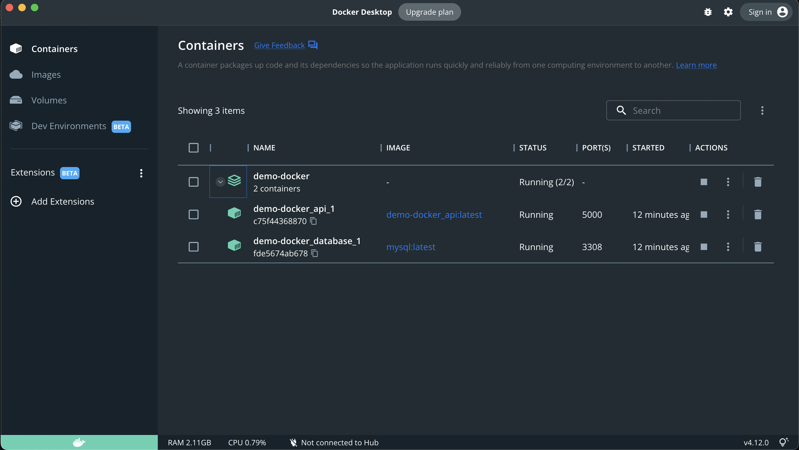
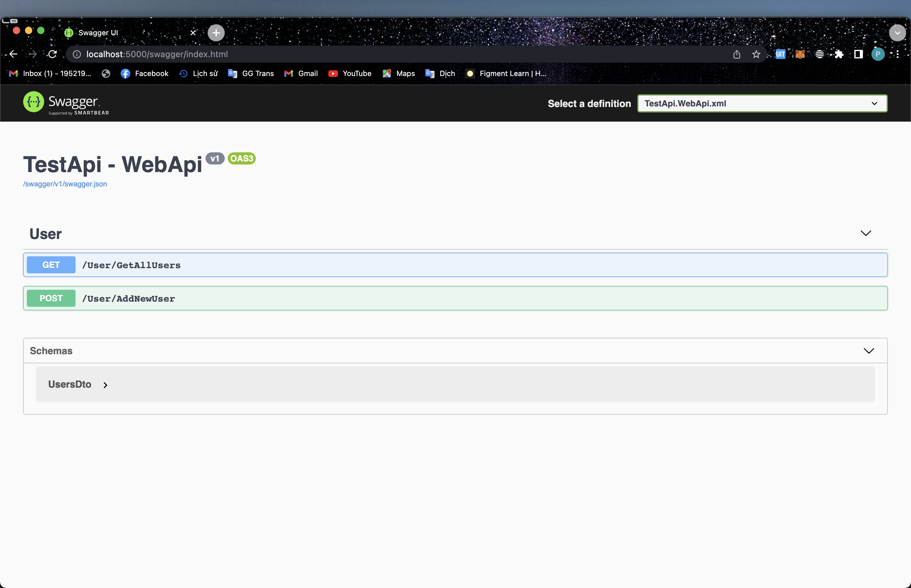
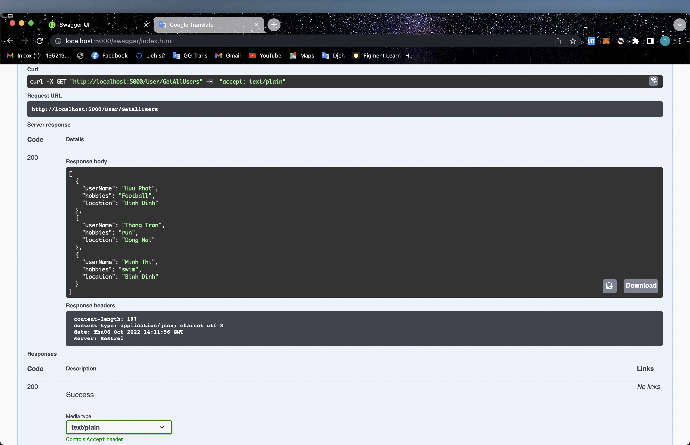
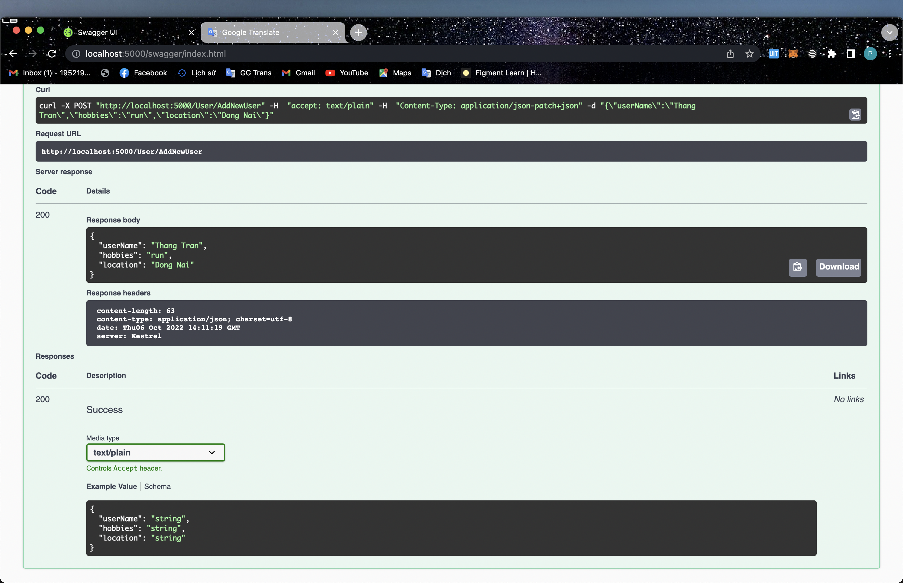

# Demo-Docker
## Table of Contents
* [Introduction](#introduction)
* [Video Demo](#video-demo)
* [Technologies Used](#technologies-used)
* [How to install and run the project](#how-to-install-and-run-the-project)
## Introduction

This project to demo how to build a project use docker.







## Video Demo
You can have a look with Demo through [this video](https://www.youtube.com/watch?v=11Aqoa7bFJ0).


## Technologies Used
Demo use the following technologies, frameworks and development techniques:
- Bakckend - [Dotnet](https://dotnet.microsoft.com/en-us/)
- Database - [MySQL](https://www.mysql.com/)
- Engine - [Docker](https://www.docker.com/)

## How to install and run the project

To clone and run this application, you'll need [Visual Studio Code](https://code.visualstudio.com/), [Docker](https://www.docker.com/) installed on your computer. 

```
*** Run Back-end

$ docker-compose up -d 

$ docker exec -it demo-docker_database_1 bash

$ mysql -u root -p

MYSQL_ROOT_PASSWORD: root ==> password: root
$ root
```


The swagger is run on [SWAGGER](http://localhost:5000/swagger/index.html)


## Development Team
- [Tran Quoc Thang](https://github.com/LucasTran-tq)
- [Nguyen Huu Phat](https://github.com/nguyenhuuphat2001)
- [Nguyen Minh Thi](https://github.com/minhthi-uit)

